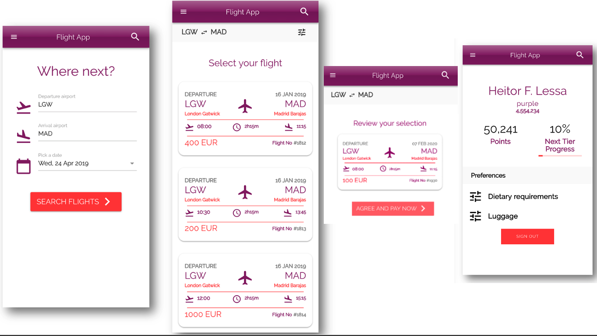

# TEAM BUILDING ACTIVITY

## AWS Serverless Airline Booking

Serverless Airline Booking is a complete web application that provides Flight Search, Payment, Booking and Loyalty points.

## Stack

Summary of what the stack looks like now including a picture with the core tech:

Service | Language | Description
------------------------------------------------- | ------------------------------------------------- | ---------------------------------------------------------------------------------
[Catalog](./catalog.md) | FREE TO CHOOSE | Provides Flight search. 
[Booking](./booking.md) | FREE TO CHOOSE | Provides new and list Bookings. 
[Payment](./payment.md) | FREE TO CHOOSE | Provides payment authorization ,collection  and refund in case of cancellation.  
[Loyality](./loyality.md) | FREE TO CHOOSE | Provides Loyalty points for customers including tiers. Fetching and ingesting Loyalty points to the user profiles.
