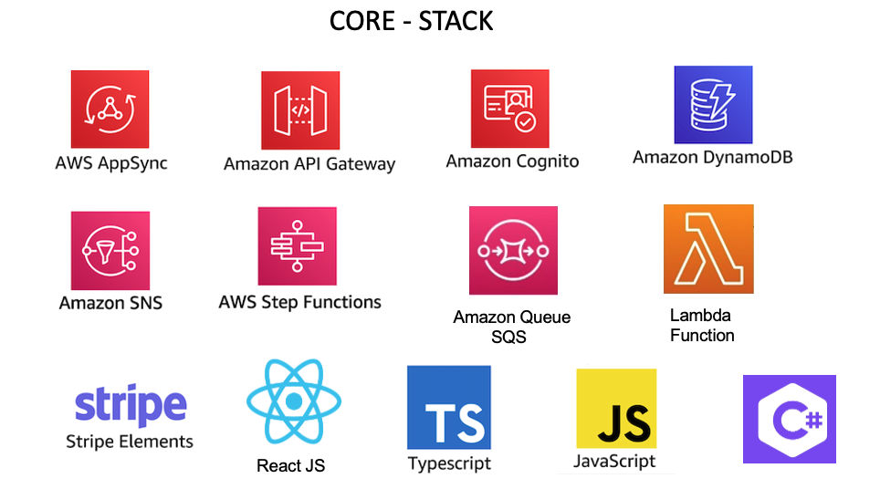

# TEAM BUILDING ACTIVITY

## **Airline Booking System**

Serverless Airline Booking is a complete web application that provides Flight Search, Payment, Booking and Loyalty points.

 

## **STACK**

Summary of what the stack looks like now including a picture with the core tech:

  

Service | Language | Description
------------------------------------------------- | ------------------------------------------------- | ---------------------------------------------------------------------------------
[Catalog](./catalog.md) | FREE TO CHOOSE | Provides log & Flight search. 
[Booking](./booking.md) | FREE TO CHOOSE | Provides make a new booking and showing the list of existing bookings. 
[Payment](./payment.md) | FREE TO CHOOSE | Provides payment authorization ,collection  and refund in case of cancellation.  
[Loyalty](./loyalty.md) | FREE TO CHOOSE | Provides Loyalty points for customers including tiers. Fetching and ingesting Loyalty points to the user profiles(this is not included in the team building activity).
