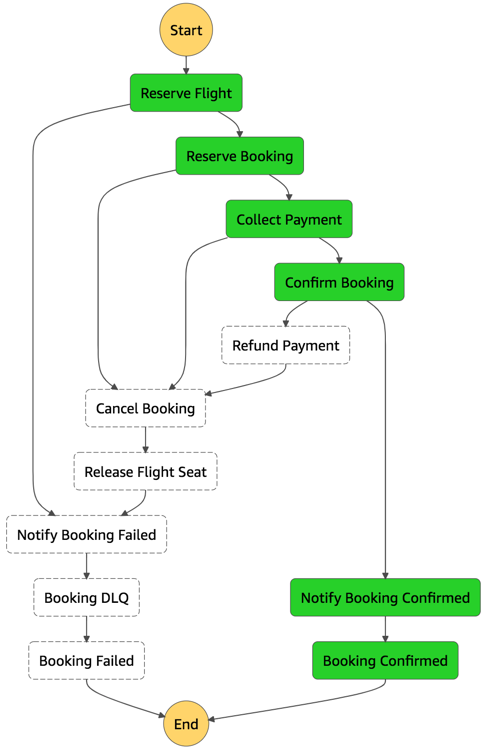

## **Booking service**
  <br>  
Booking service provides reservation, confirmation and cancellation operations.

* "As a customer, I want to be able to see all my confirmed bookings. 

* "As a customer, I'd like to be able to cancel an ongoing booking before it is confirmed.
* "As a customer, I'd like to be able to make a new booking.
* "As a customer, I'd like to be able to make a new booking and get it confirmed by withdrawing funds from my credit card provided.

<br>

### **Booking integration**

Front-end service will provide you with `pre-authorization token` and If a booking is successful, booking will then call Payment service to collect payment with same given `pre-authorization token` as it is required to identify the customer again in Stripe.
-  You have to work with Payment service to define a contract and authorization for collecting payments.
-  You have to work with Front-End to define a contract, authorization and data needed to be able to make the booking.
-   If payment is successful, front-end expects the response to tell the customer that the payment is done and booking is confirmed.

<br>



<br>

### **Front-end integration**

#### **Pre-authorizing payment**

Front-end sends payment form data directly to Payment service in the following payload format:

```json
{
    "name": "Demo",
    "address_postcode": "EC1A 2FD",
    "address_country": "UK",
    "email": "customerEmail",
    "amount": 100,
    "currency": "EUR",
    "description": "Payment by lessa@amazon.co.uk",
    "card": {
       "number": "1055 444 3032 4679",
       "expireMonth": "1",
       "expireYear": "22",
       "cvc": "444"
    }
}
```

> Future reference: We may change implementation and encrypt payment form in the browser, requiring payment service to decrypt on their side.


