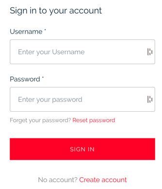
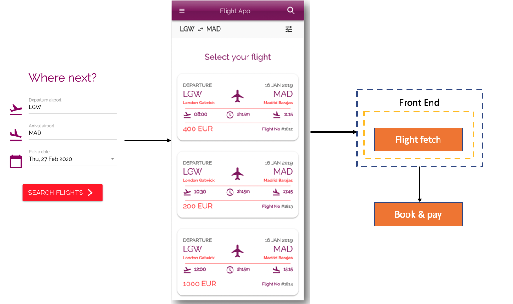

## **Catalog service**
     
Catalog service provides an integration towards Lufthansa API showing All flights based on customer data.

* "As a customer, I'd like to be able to log in to the flight app.
* "As a customer, I'd like to be able to save my credit-card information after first login/signup.
* "As a customer, I want to be able to see all flights related to a specific date/departure airport/destination airport.

* "As a customer, I'd like to be able to reserve one flight of the available list of flights

 

### **Catalog integration**

Catalog service will provide payment service with credit-card information to get `pre-authorization token` from Stripe. Catalog service will provide the booking service all data related to the specific flight to make booking successful,

-  You have to work with Payment service to define a contract and pre-authorization process.
-  You have to work with Booking to define a contract, authorization and data needed to be able to make the booking successful.
-   If payment is successful, Catalog service expects the response to tell the customer that the payment is done and booking is confirmed.

 

 

 

