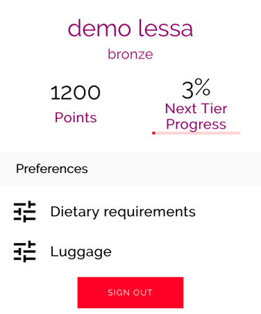

## **Loyalty service**
     
Loyalty service provides an overview about loyalty points for customers including tiers.

*  "As a customer, I want to be able to see all my points that collected based on my flight's bookings that I make for the whole year.

 

### **Loyalty integration**

Booking service will provide loyalty service with the confirmed booking to the loyalty service 

-  You have to work with booking service to define a contract and booking confirmation process to be able to calculate the points.
-  You have to work with catalog to define a contract and data needed to be able to make the visualization correct.

 

